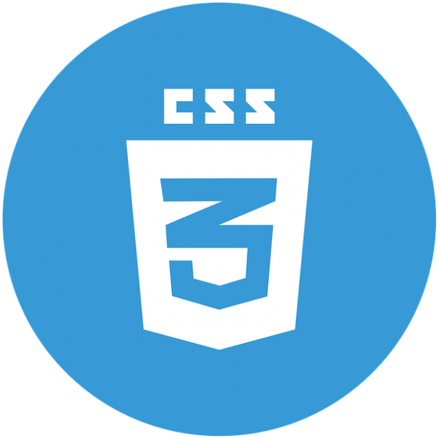

# Rab Campbell,   Graduate Software Engineer

    I've been a programmer now for coming on 3 years and have finally graduated with a BSc from Bournmeouth University! Just recently landed my first job but still want to keep up the fun programming where i can!

# Example projects...

<!--
**rcampbell1337/rcampbell1337** is a ✨ _special_ ✨ repository because its `README.md` (this file) appears on your GitHub profile.

Here are some ideas to get you started:

- 🔭 I’m currently working on ...
- 🌱 I’m currently learning ...
- 👯 I’m looking to collaborate on ...
- 🤔 I’m looking for help with ...
- 💬 Ask me about ...
- 📫 How to reach me: ...
- 😄 Pronouns: ...
- ⚡ Fun fact: ...
-->
