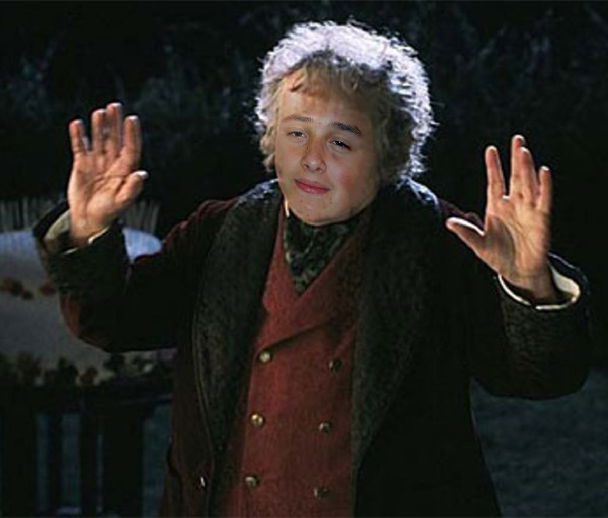

 

## RAB CAMPBELL, SOFTWARE ENGINEER

I've been a Software Engineer for the last 5 years and this profile has taken a bit of a second place now I work professionally. Most of the projects I now work on are private, however, some of my more legacy (and still quite good) projects can be found on here.

## LANGUAGES AND TOOLS

 

